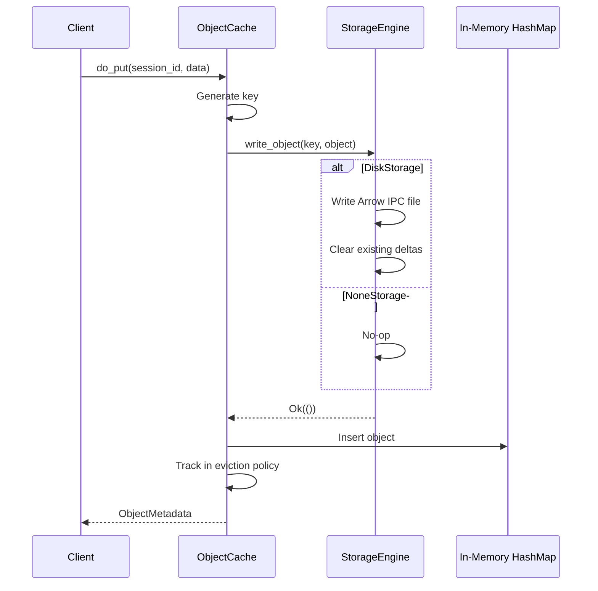

# Design Document: None Storage for Object Cache

## 1. Motivation

**Background:**

Currently, Flame's Object Cache (`object_cache` crate) always persists data to disk using Arrow IPC format. While this provides durability and crash recovery, it introduces disk I/O overhead that can impact performance for compute-oriented workloads.

The Object Cache currently:
- Writes every object to disk immediately on `put`/`update`
- Stores delta files on disk for `patch` operations
- Loads objects from disk on cache miss or restart

For some workloads, this persistence is unnecessary:
1. **Real-time Processing**: Task results are consumed immediately; historical objects are not needed
2. **Ephemeral Compute**: Objects are temporary intermediate results that don't need durability
3. **High-Throughput Scenarios**: Disk I/O becomes the performance bottleneck
4. **Development and Testing**: Fast iteration without persistence overhead

**Reference Implementation:**

The Session Manager already implements a similar pattern with `storage.engine`:
- `session_manager/src/storage/engine/mod.rs` - `Engine` trait + `connect()` factory
- `session_manager/src/storage/engine/none.rs` - `NoneEngine` implementation
- `session_manager/src/storage/engine/sqlite.rs` - `SqliteEngine` implementation
- `session_manager/src/storage/engine/filesystem.rs` - `FilesystemEngine` implementation

**Target:**

This design aims to:

1. **Introduce a Storage Engine Trait** - Abstract storage operations behind a trait
2. **Implement "None" Storage Engine** - A memory-only backend with no disk persistence
3. **Maintain API Compatibility** - No changes to gRPC/Flight APIs or client SDKs
4. **Improve Performance** - Eliminate disk I/O for compute-oriented workloads

## 2. Function Specification

**Configuration:**

Enhance `cache.storage` field to support URL-style configuration (consistent with `cluster.storage` for session manager):

```yaml
cache:
  endpoint: "grpc://127.0.0.1:9090"
  network_interface: "eth0"
  storage: "fs:///var/lib/flame/cache"  # Filesystem storage at absolute path
  eviction:
    policy: "lru"
    max_memory: "1G"
    max_objects: 10000
```

For memory-only mode:

```yaml
cache:
  endpoint: "grpc://127.0.0.1:9090"
  network_interface: "eth0"
  storage: "none"                       # No disk persistence
  eviction:
    policy: "lru"
    max_memory: "1G"
```

**Supported URL Schemes:**

| Scheme | Example | Description |
|--------|---------|-------------|
| `none` | `none` | Memory-only, no persistence |
| `fs://` | `fs:///var/lib/flame/cache` | Filesystem storage (absolute path) |
| `file://` | `file:///var/lib/flame/cache` | Alias for `fs://` |
| (plain path) | `/var/lib/flame/cache` | Legacy format, treated as filesystem storage |

**Path Resolution (for `fs://` and `file://`):**
- Triple slash (e.g., `fs:///data`) - Absolute path (`/data`)
- Double slash (e.g., `fs://data`) - Relative to `FLAME_HOME` (`${FLAME_HOME}/data`)

**Configuration Options:**

| Field | Type | Default | Description |
|-------|------|---------|-------------|
| `storage` | `String` | None | Storage URL: `none`, `fs:///path`, or legacy path |

**Behavior Matrix:**

| `storage` Value | Behavior |
|-----------------|----------|
| `"none"` | Memory-only, no persistence |
| `"fs:///path"` or `"file:///path"` | Filesystem storage at specified path |
| `"/path"` (plain path, legacy) | Filesystem storage at specified path |
| Not set or empty | Warning logged, falls back to `none` |

**Environment Variables:**

- `FLAME_CACHE_STORAGE`: Override storage URL (e.g., `none`, `fs:///tmp/cache`)

**API:**

No changes to external Flight APIs. The storage engine is an internal implementation detail:

- `do_put`: Upload an object → stored in memory (+ disk if disk backend)
- `do_get`: Retrieve an object → from memory or disk
- `do_action(PUT/UPDATE/DELETE/PATCH)`: Same behavior, different persistence

**CLI:**

No changes to CLI. Storage type is selected via `flame-cluster.yaml` configuration.

**Scope:**

*In Scope:*
- `StorageEngine` trait abstracting storage operations
- `DiskStorage` implementation (extract existing disk I/O from `cache.rs`)
- `NoneStorage` implementation (memory-only, no persistence)
- URL-style configuration via `cache.storage` field
- Thread-safe concurrent access

*Out of Scope:*
- Distributed cache storage (single-node only)
- Object replication or backup
- Tiered storage (memory + disk fallback)
- TTL-based cleanup (existing eviction handles this)

*Limitations:*
- With `none` storage, all cached objects are lost on restart
- With `none` storage, evicted objects cannot be recovered
- `patch` operation is not supported with `none` storage (returns error)

**Feature Interaction:**

*Related Features:*
- **RFE394 None Storage for Session Manager**: Similar pattern, different component
- **RFE366 LRU Eviction Policy**: Eviction policy remains unchanged
- **RFE318 Object Cache**: Base implementation being extended

*Updates Required:*
1. `object_cache/src/storage/mod.rs`: New module with `StorageEngine` trait and `connect()` factory
2. `object_cache/src/storage/disk.rs`: Extract disk I/O from `cache.rs`
3. `object_cache/src/storage/none.rs`: New `NoneStorage` implementation
4. `object_cache/src/cache.rs`: Refactor to use `StorageEngine`
5. No changes needed to `common/src/ctx.rs` (reuse existing `storage` field)

*Integration Points:*
- Storage backend integrates via `StorageEngine` trait
- ObjectCache delegates all I/O to storage engine
- Eviction policy unchanged (operates on in-memory index)

*Compatibility:*
- Fully backward compatible: existing plain path configs (e.g., `/var/lib/flame/cache`) continue to work
- New URL-style configs (`fs:///path`, `none`) provide explicit control

*Breaking Changes:*
- None. `storage: "none"` is opt-in; existing path-based configs work unchanged.
- `patch` operation returns error with none storage (design decision)

## 3. Implementation Detail

**Architecture:**

```
┌─────────────────────────────────────────────────────────────────────┐
│                         ObjectCache                                  │
├─────────────────────────────────────────────────────────────────────┤
│  endpoint: CacheEndpoint                                            │
│  storage: StorageEnginePtr  ──────┐                                │
│  objects: HashMap<String, Object>  │                                │
│  metadata: HashMap<String, Meta>   │                                │
│  eviction_policy: EvictionPolicy   │                                │
└────────────────────────────────────┼────────────────────────────────┘
                                     │
                    ┌────────────────┴────────────────┐
                    │      StorageEngine Trait       │
                    ├─────────────────────────────────┤
                    │  write_object()                 │
                    │  read_object()                  │
                    │  patch_object()                 │
                    │  delete_object()                │
                    │  delete_objects()               │
                    │  load_objects()                 │
                    └────────────────┬────────────────┘
                                     │
              ┌──────────────────────┼──────────────────────┐
              │                      │                      │
     ┌────────┴────────┐    ┌───────┴───────┐              │
     │   DiskStorage   │    │  NoneStorage  │              │
     ├─────────────────┤    ├───────────────┤              │
     │ storage_path    │    │ (no fields)   │              │
     │                 │    │               │              │
     │ Arrow IPC files │    │ All ops no-op │              │
     │ Delta files     │    │ Returns Ok()  │              │
     └─────────────────┘    └───────────────┘              │
                                                           │
                                    Future: Other backends ┘
```

**Components:**

### Component 1: StorageEngine Trait (`object_cache/src/storage/mod.rs`)

```rust
use async_trait::async_trait;
use common::FlameError;
use crate::{Object, ObjectMetadata};

/// Storage backend trait for ObjectCache.
///
/// Implementations must be thread-safe (Send + Sync).
/// 
/// The storage engine is responsible for:
/// - Persisting objects (base data + deltas)
/// - Managing delta files internally
/// - Loading objects with their deltas on read
#[async_trait]
pub trait StorageEngine: Send + Sync + 'static {
    /// Write an object to persistent storage.
    /// Clears any existing deltas for this key.
    async fn write_object(&self, key: &str, object: &Object) -> Result<(), FlameError>;
    
    /// Read an object from persistent storage.
    /// Returns the object with all deltas populated in `object.deltas`.
    /// Returns None if object doesn't exist in storage.
    async fn read_object(&self, key: &str) -> Result<Option<Object>, FlameError>;
    
    /// Append a delta to an existing object (PATCH operation).
    /// Returns updated metadata including new delta count.
    /// 
    /// # Errors
    /// - Returns NotFound if the base object doesn't exist
    /// - Returns InvalidConfig if patch is not supported (e.g., none storage)
    async fn patch_object(&self, key: &str, delta: &Object) -> Result<ObjectMetadata, FlameError>;
    
    /// Delete an object and all its deltas from persistent storage.
    async fn delete_object(&self, key: &str) -> Result<(), FlameError>;
    
    /// Delete all objects for a session.
    async fn delete_objects(&self, session_id: &str) -> Result<(), FlameError>;
    
    /// Load all objects from storage (for startup recovery).
    /// Returns Vec of (key, object, delta_count).
    /// Objects are returned with deltas populated.
    async fn load_objects(&self) -> Result<Vec<(String, Object, u64)>, FlameError>;
}

pub type StorageEnginePtr = Box<dyn StorageEngine>;
```

### Component 2: DiskStorage (`object_cache/src/storage/disk.rs`)

Extract existing disk I/O logic from `cache.rs`:

```rust
use std::fs;
use std::path::{Path, PathBuf};
use async_trait::async_trait;
use rayon::prelude::*;

use common::FlameError;
use crate::{Object, ObjectMetadata};
use super::StorageEngine;

/// Maximum number of deltas allowed per object before requiring compaction.
const MAX_DELTAS_PER_OBJECT: u64 = 1000;

/// Disk-based storage engine using Arrow IPC format.
pub struct DiskStorage {
    storage_path: PathBuf,
}

impl DiskStorage {
    pub fn new(storage_path: PathBuf) -> Result<Self, FlameError> {
        if !storage_path.exists() {
            tracing::info!("Creating storage directory: {:?}", storage_path);
            fs::create_dir_all(&storage_path)?;
        }
        Ok(Self { storage_path })
    }
    
    fn object_path(&self, key: &str) -> PathBuf {
        self.storage_path.join(format!("{}.arrow", key))
    }
    
    fn delta_dir(&self, key: &str) -> PathBuf {
        self.storage_path.join(format!("{}.deltas", key))
    }
    
    fn session_dir(&self, session_id: &str) -> PathBuf {
        self.storage_path.join(session_id)
    }
    
    /// Count the number of delta files for an object.
    fn count_deltas(&self, key: &str) -> u64 {
        let delta_dir = self.delta_dir(key);
        if !delta_dir.exists() {
            return 0;
        }
        
        fs::read_dir(&delta_dir)
            .map(|entries| {
                entries
                    .filter_map(|e| e.ok())
                    .filter(|e| e.path().extension().and_then(|ext| ext.to_str()) == Some("arrow"))
                    .count() as u64
            })
            .unwrap_or(0)
    }
    
    /// Clear all deltas for an object.
    fn clear_deltas(&self, key: &str) -> Result<(), FlameError> {
        let delta_dir = self.delta_dir(key);
        if delta_dir.exists() {
            fs::remove_dir_all(&delta_dir)?;
            tracing::debug!("Cleared deltas for object: {}", key);
        }
        Ok(())
    }
    
    /// Read all deltas for an object, sorted by index.
    fn read_deltas(&self, key: &str) -> Result<Vec<Object>, FlameError> {
        let delta_dir = self.delta_dir(key);
        if !delta_dir.exists() {
            return Ok(Vec::new());
        }
        
        let mut delta_files: Vec<_> = fs::read_dir(&delta_dir)?
            .filter_map(|e| e.ok())
            .filter(|e| e.path().extension().and_then(|ext| ext.to_str()) == Some("arrow"))
            .collect();
        
        delta_files.sort_by_key(|e| {
            e.path()
                .file_stem()
                .and_then(|s| s.to_str())
                .and_then(|s| s.parse::<u64>().ok())
                .unwrap_or(u64::MAX)
        });
        
        delta_files
            .into_par_iter()
            .map(|entry| load_object_from_file(&entry.path()))
            .collect()
    }
}

#[async_trait]
impl StorageEngine for DiskStorage {
    async fn write_object(&self, key: &str, object: &Object) -> Result<(), FlameError> {
        let parts: Vec<&str> = key.split('/').collect();
        if parts.len() != 2 {
            return Err(FlameError::InvalidConfig(format!("Invalid key format: {}", key)));
        }
        let session_id = parts[0];
        
        // Create session directory
        let session_dir = self.session_dir(session_id);
        fs::create_dir_all(&session_dir)?;
        
        // Write object to Arrow IPC file
        let object_path = self.object_path(key);
        let batch = object_to_batch(object)?;
        write_batch_to_file(&object_path, &batch)?;
        
        // Clear any existing deltas (clean slate)
        self.clear_deltas(key)?;
        
        tracing::debug!("Wrote object to disk: {:?}", object_path);
        Ok(())
    }
    
    async fn read_object(&self, key: &str) -> Result<Option<Object>, FlameError> {
        let object_path = self.object_path(key);
        if !object_path.exists() {
            return Ok(None);
        }
        
        // Load base object
        let base = load_object_from_file(&object_path)?;
        
        // Load deltas and return object with deltas populated
        let deltas = self.read_deltas(key)?;
        Ok(Some(Object::with_deltas(base.version, base.data, deltas)))
    }
    
    async fn patch_object(&self, key: &str, delta: &Object) -> Result<ObjectMetadata, FlameError> {
        let object_path = self.object_path(key);
        if !object_path.exists() {
            return Err(FlameError::NotFound(format!(
                "object <{}> not found, must put first",
                key
            )));
        }
        
        let current_delta_count = self.count_deltas(key);
        if current_delta_count >= MAX_DELTAS_PER_OBJECT {
            return Err(FlameError::InvalidState(format!(
                "object <{}> has reached maximum delta count ({}). Use update_object to compact deltas.",
                key, MAX_DELTAS_PER_OBJECT
            )));
        }
        
        // Write delta file
        let delta_dir = self.delta_dir(key);
        fs::create_dir_all(&delta_dir)?;
        
        let delta_path = delta_dir.join(format!("{}.arrow", current_delta_count));
        let batch = object_to_batch(delta)?;
        write_batch_to_file(&delta_path, &batch)?;
        
        tracing::debug!("Wrote delta {} to disk: {:?}", current_delta_count, delta_path);
        
        // Return updated metadata
        let size = fs::metadata(&object_path)?.len();
        Ok(ObjectMetadata {
            endpoint: String::new(),  // Caller fills this in
            key: key.to_string(),
            version: 0,
            size,
            delta_count: current_delta_count + 1,
        })
    }
    
    async fn delete_object(&self, key: &str) -> Result<(), FlameError> {
        let object_path = self.object_path(key);
        if object_path.exists() {
            fs::remove_file(&object_path)?;
        }
        self.clear_deltas(key)?;
        Ok(())
    }
    
    async fn delete_objects(&self, session_id: &str) -> Result<(), FlameError> {
        let session_dir = self.session_dir(session_id);
        if session_dir.exists() {
            fs::remove_dir_all(&session_dir)?;
            tracing::debug!("Deleted session directory: {:?}", session_dir);
        }
        Ok(())
    }
    
    async fn load_objects(&self) -> Result<Vec<(String, Object, u64)>, FlameError> {
        let mut results = Vec::new();
        
        if !self.storage_path.exists() {
            return Ok(results);
        }
        
        for session_entry in fs::read_dir(&self.storage_path)? {
            let session_entry = session_entry?;
            let session_path = session_entry.path();
            
            if !session_path.is_dir() {
                continue;
            }
            
            let session_id = session_path
                .file_name()
                .and_then(|n| n.to_str())
                .ok_or_else(|| FlameError::Internal("Invalid session directory name".to_string()))?;
            
            for object_entry in fs::read_dir(&session_path)? {
                let object_entry = object_entry?;
                let object_path = object_entry.path();
                
                // Skip delta directories
                if object_path.is_dir() {
                    continue;
                }
                
                if object_path.extension().and_then(|e| e.to_str()) != Some("arrow") {
                    continue;
                }
                
                let object_id = object_path
                    .file_stem()
                    .and_then(|n| n.to_str())
                    .ok_or_else(|| FlameError::Internal("Invalid object file name".to_string()))?;
                
                let key = format!("{}/{}", session_id, object_id);
                let delta_count = self.count_deltas(&key);
                
                // Load base object
                let base = load_object_from_file(&object_path)?;
                
                // Load deltas
                let deltas = self.read_deltas(&key)?;
                let object = Object::with_deltas(base.version, base.data, deltas);
                
                results.push((key, object, delta_count));
            }
        }
        
        tracing::info!("Loaded {} objects from disk", results.len());
        Ok(results)
    }
}
```

### Component 3: NoneStorage (`object_cache/src/storage/none.rs`)

```rust
use async_trait::async_trait;
use common::FlameError;
use crate::{Object, ObjectMetadata};
use super::StorageEngine;

/// Memory-only storage engine - no persistence.
///
/// All storage operations are no-ops. The in-memory HashMap in ObjectCache
/// is the sole source of truth.
///
/// Use cases:
/// - Real-time processing where objects are consumed immediately
/// - High-throughput scenarios where disk I/O is a bottleneck
/// - Development and testing
///
/// Limitations:
/// - All cached objects are lost on restart
/// - Evicted objects cannot be recovered from disk
/// - Patch operations are not supported (returns error)
pub struct NoneStorage;

impl NoneStorage {
    pub fn new() -> Self {
        tracing::info!("Using none storage engine (no persistence)");
        Self
    }
}

impl Default for NoneStorage {
    fn default() -> Self {
        Self::new()
    }
}

#[async_trait]
impl StorageEngine for NoneStorage {
    async fn write_object(&self, _key: &str, _object: &Object) -> Result<(), FlameError> {
        // No-op: object is stored in ObjectCache's in-memory HashMap
        Ok(())
    }
    
    async fn read_object(&self, _key: &str) -> Result<Option<Object>, FlameError> {
        // Nothing persisted - object must be in memory or it's gone
        Ok(None)
    }
    
    async fn patch_object(&self, key: &str, _delta: &Object) -> Result<ObjectMetadata, FlameError> {
        // Patch not supported with none storage
        Err(FlameError::InvalidConfig(format!(
            "patch operation not supported with none storage for object <{}>. Use update_object instead.",
            key
        )))
    }
    
    async fn delete_object(&self, _key: &str) -> Result<(), FlameError> {
        // No-op: nothing to delete from disk
        Ok(())
    }
    
    async fn delete_objects(&self, _session_id: &str) -> Result<(), FlameError> {
        // No-op: nothing to delete from disk
        Ok(())
    }
    
    async fn load_objects(&self) -> Result<Vec<(String, Object, u64)>, FlameError> {
        // Nothing to load
        Ok(Vec::new())
    }
}
```

### Component 4: Storage Factory (`object_cache/src/storage/mod.rs`)

```rust
mod disk;
mod none;

pub use disk::DiskStorage;
pub use none::NoneStorage;

use std::path::PathBuf;
use common::FlameError;

// ... trait definition above ...

/// Connect to a storage engine based on the URL scheme.
///
/// Supported URL schemes:
/// - `none` - Memory-only, no persistence
/// - `fs://` or `file://` - Filesystem storage
/// - Plain path (legacy) - Treated as filesystem storage
///
/// Path resolution for `fs://`:
/// - Triple slash (e.g., `fs:///data`) - Absolute path (`/data`)
/// - Double slash (e.g., `fs://data`) - Relative to FLAME_HOME (`${FLAME_HOME}/data`)
///
/// # Examples
///
/// ```ignore
/// // Memory-only storage
/// let storage = connect("none").await?;
///
/// // Filesystem storage (absolute path)
/// let storage = connect("fs:///var/lib/flame/cache").await?;
///
/// // Filesystem storage (relative to FLAME_HOME)
/// let storage = connect("fs://cache").await?;  // -> ${FLAME_HOME}/cache
///
/// // Legacy plain path (still supported)
/// let storage = connect("/var/lib/flame/cache").await?;
/// ```
pub async fn connect(url: &str) -> Result<StorageEnginePtr, FlameError> {
    // Check environment variable override
    let url = std::env::var("FLAME_CACHE_STORAGE")
        .ok()
        .unwrap_or_else(|| url.to_string());
    
    if url.is_empty() {
        tracing::warn!("No cache storage configured - using none storage (no persistence)");
        return Ok(Box::new(NoneStorage::new()));
    }
    
    if url == "none" {
        tracing::info!("Cache storage: none (memory-only, no persistence)");
        return Ok(Box::new(NoneStorage::new()));
    }
    
    // Parse filesystem URL or plain path
    let storage_path = if url.starts_with("fs://") || url.starts_with("file://") {
        parse_storage_url(&url)?
    } else {
        // Legacy plain path support
        PathBuf::from(&url)
    };
    
    tracing::info!("Cache storage: filesystem at {:?}", storage_path);
    Ok(Box::new(DiskStorage::new(storage_path)?))
}

/// Parse storage URL and resolve path.
fn parse_storage_url(url: &str) -> Result<PathBuf, FlameError> {
    let path_part = url
        .strip_prefix("fs://")
        .or_else(|| url.strip_prefix("file://"))
        .ok_or_else(|| FlameError::InvalidConfig(format!("Invalid storage URL: {}", url)))?;
    
    if path_part.starts_with('/') {
        // Absolute path (triple slash: fs:///path -> /path)
        Ok(PathBuf::from(path_part))
    } else {
        // Relative to FLAME_HOME (double slash: fs://path -> ${FLAME_HOME}/path)
        let flame_home = std::env::var("FLAME_HOME")
            .unwrap_or_else(|_| "/var/lib/flame".to_string());
        Ok(PathBuf::from(flame_home).join(path_part))
    }
}
```

### Component 5: ObjectCache Refactoring

Update `ObjectCache` struct in `cache.rs`:

```rust
pub struct ObjectCache {
    endpoint: CacheEndpoint,
    storage: StorageEnginePtr,  // Changed from: storage_path: Option<PathBuf>
    objects: MutexPtr<HashMap<String, Object>>,
    metadata: MutexPtr<HashMap<String, ObjectMetadata>>,
    eviction_policy: EvictionPolicyPtr,
}
```

Key method changes:

```rust
impl ObjectCache {
    fn new(
        endpoint: CacheEndpoint,
        storage: StorageEnginePtr,
        eviction_config: Option<&EvictionConfig>,
    ) -> Result<Self, FlameError> {
        // ... initialization
    }
    
    async fn put_with_id(...) -> Result<ObjectMetadata, FlameError> {
        // ...
        // Write to storage (no-op for NoneStorage)
        // This also clears any existing deltas
        self.storage.write_object(&key, &object).await?;
        // ...
    }
    
    async fn get(&self, key: String) -> Result<Object, FlameError> {
        // Check memory first
        // ...
        
        // Try to load from storage (returns None for NoneStorage)
        // Storage returns object with deltas already populated
        if let Some(object) = self.storage.read_object(&key).await? {
            // Add to memory, return
        }
        
        Err(FlameError::NotFound(...))
    }
    
    async fn patch(&self, key: String, delta: Object) -> Result<ObjectMetadata, FlameError> {
        // Delegate to storage engine (returns error for NoneStorage)
        let mut meta = self.storage.patch_object(&key, &delta).await?;
        meta.endpoint = self.endpoint.to_uri();
        
        // Update metadata in memory
        {
            let mut metadata = lock_ptr!(self.metadata)?;
            metadata.insert(key.clone(), meta.clone());
        }
        
        Ok(meta)
    }
    
    async fn load_from_storage(&self) -> Result<(), FlameError> {
        let items = self.storage.load_objects().await?;
        // Objects come with deltas already populated
        // ... populate objects and metadata from items
    }
}
```

### Component 6: Cache Server Startup

Update `run()` function in `cache.rs`:

```rust
pub async fn run(cache_config: &FlameCache) -> Result<(), FlameError> {
    let endpoint = CacheEndpoint::try_from(cache_config)?;
    
    // Connect to storage engine based on URL
    let storage_url = cache_config.storage.as_deref().unwrap_or("none");
    let storage = storage::connect(storage_url).await?;
    
    // Create eviction config
    let eviction_config = EvictionConfig { ... };
    
    // Create cache with storage engine
    let cache = Arc::new(ObjectCache::new(endpoint, storage, Some(&eviction_config))?);
    
    // Load existing objects from storage (no-op for NoneStorage)
    cache.load_from_storage().await?;
    
    // Start server...
}
```

No changes needed to `common/src/ctx.rs` - the existing `storage: Option<String>` field is reused with URL-style values.

**Data Structures:**

No new public data structures. Internal storage engine implementations are encapsulated behind the trait.

**Algorithms:**

*Object Put with Storage Engine:*
```
1. Validate session_id and object_id
2. Call storage.write_object(key, object)
   - DiskStorage: Write Arrow IPC file, clear existing deltas
   - NoneStorage: No-op
3. Update in-memory objects and metadata HashMaps
4. Track in eviction policy
5. Run eviction if needed
```

*Object Get with Storage Engine:*
```
1. Check in-memory objects HashMap
2. If found, return (deltas already in object.deltas)
3. If not found, call storage.read_object(key)
   - DiskStorage: Load from Arrow IPC file with deltas populated
   - NoneStorage: Returns None
4. If loaded from storage, add to memory and return
5. If not found anywhere, return NotFound error
```

*Patch Operation:*
```
1. Call storage.patch_object(key, delta)
   - DiskStorage: Write delta file, return updated metadata
   - NoneStorage: Return InvalidConfig error
2. Update metadata in memory
```

**Sequence Diagram - Object Put:**



**System Considerations:**

*Performance:*
- NoneStorage: ~0ms disk latency, pure memory operations
- DiskStorage: Unchanged from current implementation
- Expected improvement: 2-5x for write-heavy workloads with NoneStorage

*Scalability:*
- Memory-only storage scales with available RAM
- Eviction policy controls memory usage
- No disk I/O bottleneck with NoneStorage

*Reliability:*
- NoneStorage: Data is ephemeral by design - no recovery after restart
- DiskStorage: Unchanged durability guarantees
- Eviction with NoneStorage permanently loses objects

*Thread Safety:*
- `StorageEngine` implementations must be `Send + Sync`
- Existing locking patterns in ObjectCache preserved
- DiskStorage uses synchronous fs operations (safe with Tokio spawn_blocking if needed)

*Resource Usage:*
- Memory: Bounded by eviction policy (unchanged)
- CPU: Reduced for NoneStorage (no serialization for disk)
- Disk: None for NoneStorage

*Security:*
- No change to security model
- NoneStorage: No disk artifacts left behind

*Observability:*
- Log storage engine type on startup
- Existing metrics unchanged

**Dependencies:**

*Internal Dependencies:*
- `common`: FlameError, FlameCache config
- `stdng`: MutexPtr, lock_ptr macro (existing)

*External Dependencies:*
- `arrow`, `arrow-flight`: Unchanged (DiskStorage only)
- `async-trait`: For async trait methods

## 4. Use Cases

**Example 1: High-Throughput Compute Workload**

- Description: ML inference pipeline where intermediate tensors are cached briefly
- Configuration:
  ```yaml
  cache:
    endpoint: "grpc://127.0.0.1:9090"
    network_interface: "eth0"
    storage: "none"
    eviction:
      policy: "lru"
      max_memory: "4G"
  ```
- Workflow:
  1. Start Flame with none storage
  2. Inference tasks put/get intermediate tensors at high throughput
  3. No disk I/O overhead - pure memory operations
  4. Evicted objects are gone (acceptable for ephemeral intermediates)
  5. Restart clears cache (workers repopulate as needed)
- Expected outcome: Maximum throughput, bounded memory, ephemeral cache

**Example 2: Development and Testing**

- Description: Fast iteration during development
- Configuration:
  ```yaml
  cache:
    endpoint: "grpc://127.0.0.1:9090"
    network_interface: "lo"
    storage: "none"
    eviction:
      policy: "none"
      max_memory: "512M"
  ```
- Workflow:
  1. Developer runs local Flame cluster
  2. No disk writes during testing
  3. Each test run starts with clean cache
- Expected outcome: Fast startup, no disk cleanup needed

**Example 3: Backward Compatibility (Legacy Path)**

- Description: Existing deployment with plain path continues unchanged
- Configuration:
  ```yaml
  cache:
    endpoint: "grpc://127.0.0.1:9090"
    network_interface: "eth0"
    storage: "/var/lib/flame/cache"    # Legacy plain path still works
    eviction:
      policy: "lru"
      max_memory: "1G"
  ```
- Workflow:
  1. Upgrade to new version
  2. No config changes needed
  3. Disk persistence continues as before
- Expected outcome: Zero behavior change

**Example 4: Explicit Filesystem Storage (URL Style)**

- Description: New deployment using URL-style configuration
- Configuration:
  ```yaml
  cache:
    endpoint: "grpc://127.0.0.1:9090"
    network_interface: "eth0"
    storage: "fs:///var/lib/flame/cache"   # Explicit filesystem URL
    eviction:
      policy: "lru"
      max_memory: "2G"
  ```
- Workflow:
  1. Objects persist to disk at specified path
  2. Survives restarts
  3. Evicted objects can be reloaded from disk
- Expected outcome: Durable cache with recovery

**Example 5: FLAME_HOME Relative Path**

- Description: Storage path relative to FLAME_HOME
- Configuration:
  ```yaml
  cache:
    endpoint: "grpc://127.0.0.1:9090"
    network_interface: "eth0"
    storage: "fs://cache"              # Relative to FLAME_HOME
    eviction:
      policy: "lru"
      max_memory: "1G"
  ```
- Environment: `FLAME_HOME=/opt/flame`
- Workflow:
  1. Storage path resolves to `/opt/flame/cache`
  2. Portable configuration across environments
- Expected outcome: Environment-aware storage location

## 5. References

**Related Documents:**
- RFE394 None Storage for Session Manager: `docs/designs/RFE394-none-storage/FS.md`
- RFE318 Object Cache: `docs/designs/RFE318-cache/FS.md`
- RFE366 LRU Eviction Policy: `docs/designs/RFE366-lru-policy/FS.md`
- Design Template: `docs/designs/templates.md`

**External References:**
- GitHub Issue: https://github.com/xflops/flame/issues/414
- Apache Arrow IPC Format: https://arrow.apache.org/docs/format/Columnar.html#ipc-file-format

**Implementation References:**
- ObjectCache: `object_cache/src/cache.rs`
- Eviction Policy: `object_cache/src/eviction.rs`
- Session Manager Storage Engine: `session_manager/src/storage/engine/`
- Configuration: `common/src/ctx.rs`
